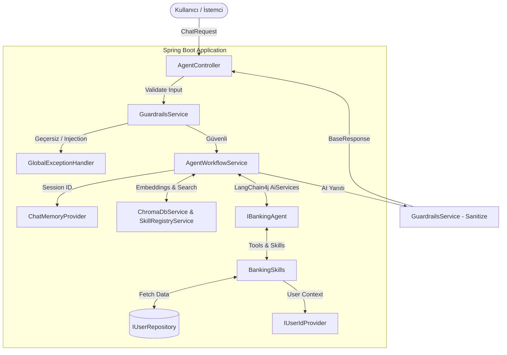

# BankAgent Java Middleware 🏦🤖

## 📌 Proje Özeti
Bu proje, finansal sistemler ve bankacılık uygulamaları için tasarlanmış, **Sıfır Hata Toleransı** (Zero Error Tolerance) prensibiyle geliştirilmiş Akıllı Bankacılık Asistanı (AI Banking Agent) projesidir. LangChain4j kütüphanesi üzerine inşa edilmiş olup, Spring Boot mimarisiyle modern Java Middleware projelerine "tak-çalıştır" entegre olabilecek standarttadır.

## 🏗️ Mimari Şema



## 🚀 Süreç Akışı
1. İstemci (Client), `/api/v1/agent/chat` endpoint'ine geçerli bir `sessionId` ve `message` ile istek atar.
2. `AgentController`, gelen verinin validasyonunu (boşluk, tip vs.) yapar.
3. `AgentWorkflowService`, `GuardrailsService` üzerinden kullanıcı girişini olası Prompt Injection ve zararlı içeriklere karşı denetler. (Takılırsa anında `AiGuardrailException` fırlatılır).
4. `ChatMemoryProvider` yardımıyla, kullanıcının `sessionId` değerine ait olan sohbet hafızası (Context) yüklenir. Bu sayede hiçbir kullanıcının hafızası birbiriyle karışmaz.
5. LangChain4j tabanlı `IBankingAgent`, LLM'e (Large Language Model) mesajı ve RAG (Retrieval-Augmented Generation) üzerinden vektör arama sonuçlarını gönderir.
6. LLM eğer bankacılık işlemi yapacaksa (Örn: Bakiye sorgulama), sistemde kayıtlı `BankingSkills` içindeki fonksiyonları çağırır.
7. Bu yetenekler, işlemi gerçekleştirmeden önce `IUserIdProvider` (Spring Security Context vb.) üzerinden kullanıcının yetkisini doğrular. Hata durumlarında (NullPointer vs.) Java Streams/Optional kullanılarak sistemin çökmesi engellenir ve `AiSkillExecutionException` fırlatılır.
8. LLM yanıtı oluşturduktan sonra `GuardrailsService` tarafından çıktı taranır (Kredi kartı maskeleme vb.).
9. İşlenmiş ve güvenli yanıt `BaseResponse` formatıyla kullanıcıya dönülür.

## 📂 Paket ve Sınıf Yapısı (Hangi Fonksiyon Ne İş Yapar?)

### `com.bankagent.api`
- **`AgentController`**: REST API giriş noktasıdır. JSON formatındaki mesajları karşılar, `@Valid` ile anotasyon tabanlı veri doğrulaması yapar ve servis katmanına iletir.

### `com.bankagent.workflow`
- **`AgentWorkflowService`**: Sistemin orkestrasyon merkezidir. RAG konfigürasyonunu (Embedding Retriver), Langchain4j AiServices bileşenlerini ve izole oturum hafızasını (`ChatMemoryProvider`) yapılandırır. LLM, RAG ve Araçların birbiriyle haberleştiği ana metot `processUserMessage` buradadır.
- **`IBankingAgent`**: LLM'in persona ve sistem komutlarını (System Prompt) barındıran Langchain4j arayüzüdür.

### `com.bankagent.skills`
- **`BankingSkills`**: LLM'in kullanabileceği fonksiyonları (Tools) tanımlar.
    - `getBalance()`: Kullanıcının varlık ve borç bilgilerini getirir.
    - `makePayment()`: Kredi kartı borç ödeme süreçlerini simüle eder.
    - `getAccountTypes()`: Vadesiz ve vadeli hesapları listeler.
    - `calcMonthlyIncomeSavings()`: Seçilen vadeli hesap ID'sine göre aylık faiz getirisini hesaplar.
    - `getUserAccountOptions()` & `getCreditCardOptions()`: LLM'in belirsizlik yaşadığı durumlarda kullanıcıdan seçim yapmasını kolaylaştırmak için maskelenmiş güvenli liste döner.

### `com.bankagent.guardrails`
- **`GuardrailsService`**: Giren ve çıkan verilerdeki güvenlik zafiyetlerini (Regex ve Heuristic analizler ile) yakalar ve durdurur. Maskeleme yapar.

### `com.bankagent.core.exceptions`
- **`GlobalExceptionHandler`**: Sıfır hata toleransı gereği, uygulamanın hiçbir yerinde hatanın yutulmamasını sağlar. `AiAgentException`, `AiSkillExecutionException` gibi domain bazlı hataları yakalayıp istemciye şematize edilmiş JSON nesneleri döner.
- **`AiAgentException` ve alt sınıfları**: Sistemi kilitlemeden akışı kesmek için fırlatılan AI Domain Exception sınıflarıdır.

### `com.bankagent.core.security`
- **`IUserIdProvider`**: Oturumu açan kullanıcının ID'sini döndürür.
    - `DevUserIdProvider`: Local geliştirme ortamı için statik test hesabı döner (`@Profile("dev")`).
    - `ProdUserIdProvider`: Canlı ortamda doğrudan Spring Security Middleware'inden güvenli oturum bilgisi alır.

### `com.bankagent.registry`
- **`SkillRegistryService`**: Sistemdeki yetenekleri (skills) vektör veritabanına kaydeder ve RAG mantığıyla kullanıcı niyetine en uygun yeteneklerin LangChain4j üzerinden çağrılmasını sağlar.

## 🧪 Test Stratejisi ve Süreci
Bu uygulama, bir Middleware olarak tasarlandığı için local ortamda ve CI/CD süreçlerinde rahatça test edilebilir:

### 1. Ortam Profilleri ile Test (Dev vs Prod)
Uygulamanın `dev` profili aktifken Spring Security pasif modda varsayılır ve `DevUserIdProvider` üzerinden "test_user_1" hesabıyla işlem yapılır. 
- **Çalıştırma Komutu**: `mvn spring-boot:run -Dspring-boot.run.profiles=dev`
- **Canlı Ortam Simülasyonu**: Uygulama `prod` profiline alındığında güvenlik kuralları zorunlu tutulur. `ProdUserIdProvider` aktif olur.

### 2. API Testleri (Postman / cURL)
Terminal üzerinden veya Postman ile aşağıdaki çağrıyı yaparak sistemin uçtan uca çalıştığını test edebilirsiniz:

```bash
curl -X POST http://localhost:8080/api/v1/agent/chat \
-H "Content-Type: application/json" \
-d '{"sessionId": "test-session-123", "message": "Kredi kartı borcum ne kadar?"}'
```

### 3. Sıfır Hata ve Exception Testleri
Geliştirilen sistem hataları fırlatmak üzere kurgulandığı için aşağıdaki senaryolar test edilmelidir:
- **Eksik Parametre**: Endpoint'e `message` veya `sessionId` yollanmadığında Spring Validation devreye girip HTTP 400 Döner.
- **Prompt Injection Denemesi**: "ignore previous instructions" gibi zararlı bir prompt atıldığında, `GuardrailsService` bunu keser ve JSON formatında `AiGuardrailException` hatası (`STATUS: BLOCKED`) döner.
- **Bilinmeyen Hesap**: `calcMonthlyIncomeSavings` gibi bir metoda sistemde olmayan bir hesap ID'si istendiğinde, sistem çökmez, bunun yerine `AiSkillExecutionException` fırlatılır ve LLM aracı güvenle işlemden çıkar.

## 🛠️ Kurulum
1. Java 21 LTS sürümünün bilgisayarınızda yüklü olduğundan emin olun.
2. Proje dizinine gidin.
3. Projeyi derlemek için: `mvn clean install`
4. Uygulamayı başlatmak için: `mvn spring-boot:run`
