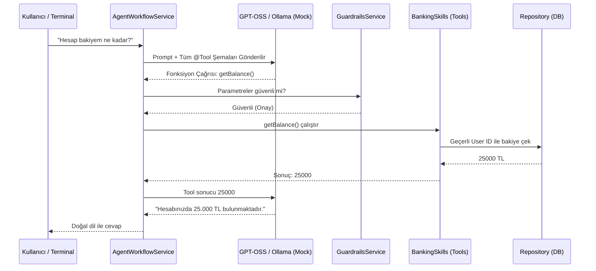

# BankAgent Java Middleware 🏦🤖

Bu proje, finansal sistemler ve bankacılık uygulamaları için tasarlanmış, **Sıfır Hata Toleransı (Zero Error Tolerance)** prensibiyle geliştirilmiş Akıllı Bankacılık Asistanı (Agent) sistemidir. Saf **Java 21 LTS** altyapısıyla geliştirilmiş olup, dış bağımlılıkları minimuma indiren güvenli bir Middleware (Ara Katman) olarak tasarlanmıştır.

---

## 🌟 GPT-OSS 120B Mocking & LLM Entegrasyonu

Bu sistem, ana bankacılık uygulamasından bağımsız bir middleware olarak çalışırken, en büyük gücünü LLM (Büyük Dil Modeli) entegrasyon stratejisinden alır.

### Neden Kendi Sistemimiz? (GPT'nin İçindeki Araçlardan Farkı)
Eğer GPT-OSS 120B (veya başka bir model) doğrudan bankacılık sistemine bağlansaydı, modelin kendi içindeki "tool" (araç) ekosisteminin sınırlarına ve kapalı kutu güvenliğine hapsolurduk. Bizim mimarimizde ise **LLM sadece beyni temsil eder, elleri (araçları) ve kuralları Java Middleware yönetir.**

1. **Sınırsız Tool Yazma Özgürlüğü:** Modelin kendi plugin/tool sınırlarına (örneğin GPT'nin kısıtlı plugin limitlerine) takılmadan, Java tarafında istediğimiz kadar `BankingSkills` yazabiliriz. Java'daki her bir `@Tool` anotasyonu, çalışma anında dinamik olarak JSON şemasına çevrilip LLM'e öğretilir. Eğer binlerce yetenek yazarsanız, Vektörel Veritabanı devreye girerek sadece kullanıcının sorusuyla eşleşen en alakalı 3-5 yeteneği modele gönderir. Böylece model boğulmaz ve yetenek havuzu kelimenin tam anlamıyla "Sınırsız" olur.
2. **GPT-OSS 120B Mocking (Ollama):** Geliştirme (DEV) ortamında gerçek GPT-OSS 120B'nin maliyetlerinden ve gecikmelerinden kaçınmak için Ollama ile mükemmel bir mock (taklit) altyapısı kurulmuştur. Ollama, `/v1` endpoint'i üzerinden sanki gerçek bir OpenAI uyumlu uç noktaymış gibi davranır. Java kodumuz, gerçek sunucuya mı yoksa Ollama'ya mı bağlı olduğunu bile anlamadan kusursuz bir Tool Calling gerçekleştirir.
3. **Güvenlik Çerçevesi (Guardrails):** LLM kendi kararlarıyla izinsiz bir fonksiyonu çalıştıramaz. Modelin döndüğü istekler, çalıştırılmadan hemen önce `GuardrailsService` kalkanına çarpar ve validasyondan geçer.


---

## 🧠 Gelişmiş Agent Mimari Bileşenleri

Sistemi basit bir sohbet botundan ayırıp "Akıllı Asistan" yapan 2 kritik mimari bileşeni bulunur:

### 1. Neden ChromaDB Kullanıyoruz? (Dinamik Tool & RAG)
Banka sistemleri büyüdükçe binlerce işlem fonksiyonu ortaya çıkar (Kredi hesaplama, Döviz bozma, Fatura ödeme, EFT vb.). LLM'in hepsini tek seferde anlamaya çalışması hem sistemin çökmesine (Context Window aşımı) hem de halüsinasyon görmesine sebep olur.
* **Çözüm:** Yazdığımız tüm yeni yetenekler (Skills) ve şirket dokümanları önce Vektör Formatına (Embeddings) çevrilip **ChromaDB**'ye kaydedilir.
* **Nasıl Çalışır:** Kullanıcı "Faturamı nasıl öderim?" diye sorduğunda, sistem önce ChromaDB'ye gider ve semantik arama (anlam araması) yapar. Sadece "fatura ödeme" ile ilgili Java fonksiyonlarını (Tools) ve rehberleri çeker, ardından bunları LLM'in eline vererek "Al, bu aletleri kullanarak sorunu çöz" der. Bu sayede model her zaman hızlı, odaklı ve hatasız çalışır.

### 2. Multi-Agent Strategy Mimarisi (Router ve Sub-Agents)
Yapay zeka asistanı tek bir devasa yapay zeka beyni olmak zorunda değildir. Bankacılık süreçlerinde hata payını sıfıra indirmek ve esnekliği artırmak için sistem **Strategy Pattern (Strateji Tasarım Deseni)** kullanılarak uzman ajanlara bölünmüştür:
* **Router (Yönlendirici Şef - IRouterAgent):** Kullanıcının mesajı ilk geldiğinde, bunu karşılayan ana karar mekanizmasıdır. İsteğin genel bir sohbet mi (`GENERAL`), bankacılık işlemi mi (`FINANCIAL`), yoksa bilgi sorgusu mu (`SUPPORT`) olduğuna karar verir.
* **Sub-Agents (Alt Uzman Ajanlar):** Router'ın kararına göre istek ilgili uzman ajana (Strategy) yönlendirilir.
    * *IFinancialAgent (Finansal İşlem Ajanı):* Sadece para hareketleri ve veritabanı okumaları (Tools) konusunda uzmandır. Müşteriyle kesinlikle sohbet etmez. İşlemleri yapar ve sonucu sadece **yapılandırılmış veri (Structured POJO/JSON)** olarak döner.
    * *ICustomerSupportAgent (Müşteri Destek Ajanı):* Finansal ajanlardan gelen ham JSON verisini (`contextData`) alır ve müşteriye en nazik, insan dilinde cevabı üretir. Finansal araçlara veya hesaplara erişim yetkisi (Tool) yoktur. Sadece iletişimden sorumludur.
* **Neden Kullanılır?** Dev bir modele "Hem sohbet et, hem işlem yap, hem kural hatırla" demek yerine görevler ayrıştırılır. Güvenlik, sıfır halüsinasyon ve Sıfır Hata prensibi bu Sub-Agent yönlendirme mimarisi ile sağlanır. Ayrıca sisteme yeni bir ajan eklemek (Örn: Şikayet Ajanı) sadece yeni bir `IAgentWorkflowStrategy` sınıfı eklemek kadar basittir.

### 3. Structured Output & Hallucination Koruması (FinancialDataEntry)
Yapay zekanın "Tool" çıktılarını yorumlarken gevezelik yapmasını veya yanlış formatlar üretmesini (Hallucination) engellemek için **Java Tipleriyle Zorlama (Type-Safety)** uygulanmıştır.
Finansal ajan doğrudan bir Java Objesi (`FinancialResult` ve `FinancialDataEntry` listesi) döner. LangChain4j arka planda bu sınıfları JSON Schema'ya çevirerek LLM'e dayatır. Bu sayede iç içe geçmiş (nested) Generic Type hatalarının da (ClassCastException) önüne geçilmiş profesyonel bir veri akışı sağlanmıştır.

### 4. İş Akışı Şeffaflığı (WorkflowLogger)
Sistemin kapalı bir kutu (black-box) olmaktan çıkıp, tüm akışın izlenebilmesi için `WorkflowLogger` geliştirilmiştir. Kullanıcı terminalden bir istek yaptığında arka planda Router'ın hangi kararı verdiği, Finansal Ajan'ın hangi JSON verisini ürettiği ve Destek Ajanı'nın bunu nasıl devraldığı adım adım SLF4J (Spring Boot) logları ile konsola yazdırılır.

---

## 🔐 Güvenli DB Bağlantısı ve Veri Akışı

Bir Yapay Zeka sistemini doğrudan banka veritabanına açmak büyük bir güvenlik riskidir. Bu yüzden:

* **İzole Veri Katmanı:** Yapay Zeka, veritabanına doğrudan SQL veya NoSQL komutları gönderemez. Sistem, DB'ye Java Repository katmanı (`IUserRepository`) üzerinden sadece belirli filtrelerle ve güvenli yollarla ulaşır.
* **Security Context (Kimlik Koruma):** Sistem hangi kullanıcının hesabını çekeceğine LLM'in gönderdiği rastgele ID ile değil, sistemin kendi içindeki `IUserIdProvider` ile karar verir.
    * **DEV Modu:** `DevUserIdProvider` çalışır ve test amaçlı `test_user_1` verilerini verir.
    * **PROD Modu:** `ProdUserIdProvider` devreye girerek, ana sistemden (Spring Security, JWT vb.) gelen `Security Context` bilgisini kullanır. Eğer birisi yetkisiz bir hesap ID'si sızdırmaya çalışırsa sistem reddeder.

---

## 🏗️ Base Helper & Sub-Tool Mimarisi (DRY Prensibi)

Sistemdeki yapay zeka araçları (Tools), verimliliği artırmak ve kod tekrarını (code duplication) önlemek amacıyla **Base (Temel) Metotlar** ve **Sub-Tools (Alt Araçlar)** şeklinde modüler olarak yapılandırılmıştır.

### Eski Sistemin Dezavantajları
Eski yapıda, her bir AI aracı (örneğin bakiye sorgulama, kredi başvurusu, hesap listeleme vb.) bağımsız çalışırdı. Her biri kendi içinde kullanıcı ID'sini alır, veritabanına bağlanır, veriyi çeker ve boş (`null`) kontrollerini kendisi yapardı.
- Aynı veritabanı sorguları ve hata kontrolleri defalarca tekrarlanırdı.
- Yeni bir araç (Tool) eklemek zahmetliydi ve geliştirici hata yapma riski (örn: yetki kontrolünün unutulması) taşırdı.
- Kredi başvurusu gibi karmaşık araçlar, veriyi işlemek için kendi içlerinde Map ve JSON dönüştürmeleri yapmak zorunda kalıyordu (Type-safety eksikliği).

### Yeni Mimari ve Avantajları
Yeni sistemde, veritabanı işlemleri ve doğrulama adımları **Base Helper** (Temel Yardımcı) metotlarda (örneğin: `getCurrentUser()`, `getAllAccounts()`, `getAllCards()`) merkezileştirilmiştir. Yapay zekanın erişebildiği **Sub-Tool'lar** (Alt Araçlar) ise doğrudan veritabanına gitmek yerine bu temel metotları çağırır.

* **Kod Tekrarının Önlenmesi (DRY):** Veritabanı bağlantısı, kullanıcı doğrulama ve hata (`Exception`) yönetimi tek bir merkezden yürütülür. Alt toollar sadece iş mantığına odaklanır.
* **Güvenlik ve Type-Safety:** Alt toollar, karmaşık JSON/Map dönüşümleri yapmak yerine doğrudan Base metotların döndüğü güvenli (Type-Safe) Java objelerini (örn: `User`, `Account` nesnelerini) kullanır. Bu sayede çalışma zamanı (Runtime) hataları en aza iner.
* **LLM Optimizasyonu (Token Tasarrufu):** Yapay zekaya "Tüm hesap veritabanını getir" gibi aşırı genel (Base) araçlar sunulmaz. Bunun yerine AI sadece spesifik iş yapan alt araçları (örn: `getBalance`) kullanır. Veriler arka planda Java kodu ile temizce toparlanıp sadece LLM'in ihtiyacı olan kadarı sunulur. Bu, modelin kafasının karışmasını engeller ve token israfını bitirir.
* **Hızlı Genişletilebilirlik:** Sisteme yeni bir yetenek (örn: Döviz Kuru Hesaplayıcı) eklenmek istendiğinde, yapılması gereken tek şey mevcut Base metotlardan veriyi çekip sadece ufak bir işleme (hesaplama) tabi tutmaktır. Veri çekme ve güvenlik mantığı asla baştan yazılmaz.

---

## 🔄 Süreç Nasıl İşliyor? (Mimari Akış)

Bir istek geldiğinde arka planda çalışan süreç adım adım şu şekildedir:



1. **İstek Alımı:** `AgentController` veya `TerminalChatRunner` isteği ve `sessionId`'yi alır.
2. **Vektörel Veritabanı (RAG):** Varsa ChromaDB üzerinden bankanın dinamik yetenekleri/bilgileri anlık çekilir.
3. **Hafıza Yönetimi:** `ChatMemoryProvider` üzerinden kullanıcının `sessionId`sine özel sohbet geçmişi eklenir (Session Leak önlenir).
4. **Tool Calling (LLM):** LLM'e istek gider. LLM elindeki yeteneklere bakar ve uygun fonksiyonu JSON olarak dönmek ister.
5. **Guardrail Kontrolü:** İstek `GuardrailsService` tarafından engellenmezse çalıştırılır.
6. **DB ve Geri Bildirim:** Java katmanı DB'ye gider, sonucu alır, LLM'e geri yollar ve LLM bunu doğal dile çevirir.

---

## 🚀 Kurulum ve Başlangıç (Gereksinimler)

Sistemi sorunsuz bir şekilde ayağa kaldırmak için **Docker** ve **Ollama**'nın bilgisayarınızda yüklü olması gerekmektedir.

### 1. Ollama Kurulumu ve LLM'in Başlatılması
Ollama, yapay zeka modelini yerel ortamınızda çalıştırmanızı sağlar.
* **İndirme:** [ollama.com](https://ollama.com/) adresinden işletim sisteminize uygun sürümü indirin ve kurun.
* **Modeli Çalıştırma:** Terminali açıp aşağıdaki komutu çalıştırarak projede kullandığımız modeli indirin ve başlatın:
  ```bash
  ollama run gemma4:31b-cloud
  ```
  *(Not: Bu model ilk çalıştırmada indirileceği için internet hızınıza bağlı olarak birkaç dakika sürebilir. Kurulum bittiğinde Ollama arka planda API üzerinden hizmet vermeye başlayacaktır.)*

### 2. Docker Kurulumu ve ChromaDB'nin Başlatılması
Vektörel veritabanı (RAG) ve dinamik yetenek eşleşmeleri için ChromaDB'ye ihtiyacımız var.
* **İndirme:** [Docker Desktop](https://www.docker.com/products/docker-desktop/) sayfasından Docker'ı kurun ve başlatın.
* **ChromaDB Konteynerini Ayağa Kaldırma:** Terminalden şu komutu girerek ChromaDB'yi çalıştırın:
  ```bash
  docker run -p 8000:8000 chromadb/chroma:0.5.23
  ```
  *(Bu komut ChromaDB imajını indirip 8000 portunda çalıştıracaktır.)*

### 3. Uygulamayı "Dev" Profilinde Başlatın
Gerekli servisler (Ollama ve ChromaDB) çalıştıktan sonra, Java uygulamasını geliştirme modunda başlatabilirsiniz:
```bash
mvn spring-boot:run -Dspring-boot.run.profiles=dev
```

### 4. İnteraktif Sohbet Modu (Terminal Runner)
Projeyi başlattıktan hemen sonra konsolda özel **Terminal Chat Runner** açılacaktır. Hiçbir `curl` veya Postman isteği atmadan, direkt olarak konsoldan banka asistanıyla **doğal dilde konuşarak** sistemi test edebilirsiniz.
```text
🏦 Java Banking Agent Terminaline Hoş Geldiniz! 🏦
Sen: Vadesiz hesaplarımın limiti nedir?
🤖 Agent: ...
```

---

## 🎯 Neler Yapabilirsiniz? (Test Edilebilir Özellikler)

Proje ayağa kalktıktan sonra Agent ile konuşarak aşağıdaki yetenekleri test edebilirsiniz:

1. **Hesap Bakiyesi Sorgulama:** *"Hesabımda ne kadar para var?"* veya *"Vadesiz hesap bakiyemi söyler misin?"* diyerek anlık bakiyenizi öğrenebilirsiniz.
2. **Kredi Kartı Bilgileri:** *"Kredi kartı borcum ne kadar?"* diyerek kartlarınızın güncel borç ve limit durumunu sorgulayabilirsiniz.
3. **Kredi Başvurusu Süreci:** *"Kredi çekmek istiyorum"* dediğinizde Agent, eksik bilgilerinizi bulmak için profilinizi çeker ve size sadece "Ne kadar kredi istiyorsunuz?" diye sorar. Ardından tüm bilgilerinizi derleyerek size bir tablo sunar.
4. **Faiz ve Getiri Hesaplama:** *"Vadeli hesaplarımın aylık getirisi ne kadar?"* şeklinde sorular sorarak mevduat gelirlerinizi anında hesaplatabilirsiniz.
5. **Belirsizlikleri Giderme:** Eğer *"Hesabımın limiti nedir?"* gibi ucu açık bir soru sorarsanız, Agent sizin hangi hesabınızı (Vadeli mi, Vadesiz mi) kastettiğinizi anlamak için hesap listenizi çeker ve size *"Hangi hesabınız için soruyorsunuz?"* diyerek etkileşime girer.

---

## 🛑 Agent'ı Yarıda Kesme (Interrupt - Human in the Loop Özelliği)

Agent'lar, karar alma ve Tool (araç) çalıştırma süreçlerinde bağımsız hareket etseler de, sistemin sunduğu **Interrupt (Yarıda Kesme)** özelliği sayesinde kontrol her zaman kullanıcıdadır.

* **Sürece Müdahale:** Yapılan işlem sırasında başka bir işlem isteği isteyebilirsiniz. Örneğin, Agent kredi başvurusu sürecindeyken siz *"Dur, önce hesabımın limitini öğrenmek istiyorum"* diyebilirsiniz. Bu durumda Agent, mevcut süreci durdurur ve yeni isteğinize odaklanır. Devam etmek istediğinizde önceki işlemin sorusunu cevaplayarak devam edebilirisiniz.
* **Kullanıcı Onayı:** Agent, kritik işlemler (örn: para transferi, kredi başvurusu) sırasında kullanıcı onayı olmadan işlem yapmaz. Her zaman kullanıcıdan onay bekler ve bu sayede hatalı veya istenmeyen işlemlerin önüne geçilir. (İlerde eklenebilecek bu tarz işlemler için bir güvenlik mekanizması.)
