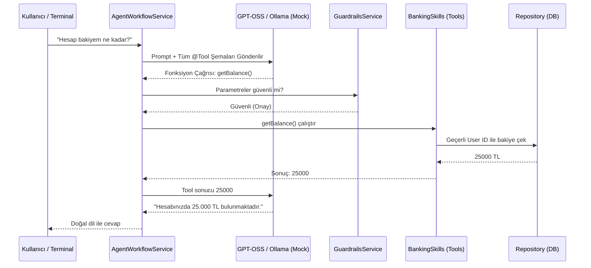

# BankAgent Java Middleware 🏦🤖

Bu proje, finansal sistemler ve bankacılık uygulamaları için tasarlanmış, **Sıfır Hata Toleransı (Zero Error Tolerance)** prensibiyle geliştirilmiş Akıllı Bankacılık Asistanı (Agent) sistemidir. Saf **Java 21 LTS** altyapısıyla geliştirilmiş olup, dış bağımlılıkları minimuma indiren güvenli bir Middleware (Ara Katman) olarak tasarlanmıştır.

---

## 🌟 GPT-OSS 120B Mocking & LLM Entegrasyonu

Bu sistem, ana bankacılık uygulamasından bağımsız bir middleware olarak çalışırken, en büyük gücünü LLM (Büyük Dil Modeli) entegrasyon stratejisinden alır.

### Neden Kendi Sistemimiz? (GPT'nin İçindeki Araçlardan Farkı)
Eğer GPT-OSS 120B (veya başka bir model) doğrudan bankacılık sistemine bağlansaydı, modelin kendi içindeki "tool" (araç) ekosisteminin sınırlarına ve kapalı kutu güvenliğine hapsolurduk. Bizim mimarimizde ise **LLM sadece beyni temsil eder, elleri (araçları) ve kuralları Java Middleware yönetir.**

1. **Sınırsız Tool Yazma Özgürlüğü:** Modelin kendi plugin/tool sınırlarına takılmadan, Java tarafında istediğimiz kadar `BankingSkills` (Banka Yetenekleri) yazabiliriz. Java'daki her bir `@Tool` anotasyonu, LLM'e otomatik olarak bir yetenek gibi sunulur. Sınır, bankanın kendi sistemleridir.
2. **GPT-OSS 120B Mocking (Ollama):** Geliştirme (DEV) ortamında gerçek GPT-OSS 120B'nin maliyetlerinden ve gecikmelerinden kaçınmak için Ollama ile mükemmel bir mock (taklit) altyapısı kurulmuştur. Ollama, `/v1` endpoint'i üzerinden sanki gerçek bir OpenAI uyumlu uç noktaymış gibi davranır. Java kodumuz, gerçek sunucuya mı yoksa Ollama'ya mı bağlı olduğunu bile anlamadan kusursuz bir Tool Calling gerçekleştirir.
3. **Güvenlik Çerçevesi (Guardrails):** LLM kendi kararlarıyla izinsiz bir fonksiyonu çalıştıramaz. Modelin döndüğü istekler, çalıştırılmadan hemen önce `GuardrailsService` kalkanına çarpar ve validasyondan geçer.

---

## 🔐 Güvenli DB Bağlantısı ve Veri Akışı

Bir Yapay Zeka sistemini doğrudan banka veritabanına açmak büyük bir güvenlik riskidir. Bu yüzden:

* **İzole Veri Katmanı:** Yapay Zeka, veritabanına doğrudan SQL veya NoSQL komutları gönderemez. Sistem, DB'ye Java Repository katmanı (`IUserRepository`) üzerinden sadece belirli filtrelerle ve güvenli yollarla ulaşır.
* **Security Context (Kimlik Koruma):** Sistem hangi kullanıcının hesabını çekeceğine LLM'in gönderdiği rastgele ID ile değil, sistemin kendi içindeki `IUserIdProvider` ile karar verir.
    * **DEV Modu:** `DevUserIdProvider` çalışır ve test amaçlı `test_user_1` verilerini verir.
    * **PROD Modu:** `ProdUserIdProvider` devreye girerek, ana sistemden (Spring Security, JWT vb.) gelen `Security Context` bilgisini kullanır. Eğer birisi yetkisiz bir hesap ID'si sızdırmaya çalışırsa sistem reddeder.

---

## 🔄 Süreç Nasıl İşliyor? (Mimari Akış)

Bir istek geldiğinde arka planda çalışan süreç adım adım şu şekildedir:



1. **İstek Alımı:** `AgentController` veya `TerminalChatRunner` isteği ve `sessionId`'yi alır.
2. **Vektörel Veritabanı (RAG):** Varsa ChromaDB üzerinden bankanın dinamik yetenekleri/bilgileri anlık çekilir.
3. **Hafıza Yönetimi:** `ChatMemoryProvider` üzerinden kullanıcının `sessionId`sine özel sohbet geçmişi eklenir (Session Leak önlenir).
4. **Tool Calling (LLM):** LLM'e istek gider. LLM elindeki yeteneklere bakar ve uygun fonksiyonu JSON olarak dönmek ister.
5. **Guardrail Kontrolü:** İstek `GuardrailsService` tarafından engellenmezse çalıştırılır.
6. **DB ve Geri Bildirim:** Java katmanı DB'ye gider, sonucu alır, LLM'e geri yollar ve LLM bunu doğal dile çevirir.

---

## 🚀 Başlangıç ve Test Etme

Sistemi sıfır hata toleransıyla test etmek ve Ollama ile iletişim kurmak için aşağıdaki adımları izleyin:

### 1. Ollama'yı Çalıştırın (Mocking İçin)
Gerçek GPT-OSS 120B yerine yerel LLM mock sistemini başlatın:
```bash
ollama run gemma4:31b-cloud
```
*(ChromaDB kullanacaksanız Docker üzerinden `chromadb/chroma:0.5.23` başlatmayı unutmayın).*

### 2. Uygulamayı "Dev" Profilinde Başlatın
Terminal veya komut isteminden:
```bash
mvn spring-boot:run -Dspring-boot.run.profiles=dev
```

### 3. İnteraktif Sohbet Modu (Terminal Runner)
Projeyi başlattıktan hemen sonra konsolda özel **Terminal Chat Runner** açılacaktır. Hiçbir `curl` veya Postman isteği atmadan direkt olarak konsoldan banka asistanıyla **doğal dilde konuşarak** sistemi test edebilirsiniz.
```text
🏦 Java Banking Agent Terminaline Hoş Geldiniz! 🏦
Sen: Vadesiz hesaplarımın limiti nedir?
🤖 Agent: ...
```
